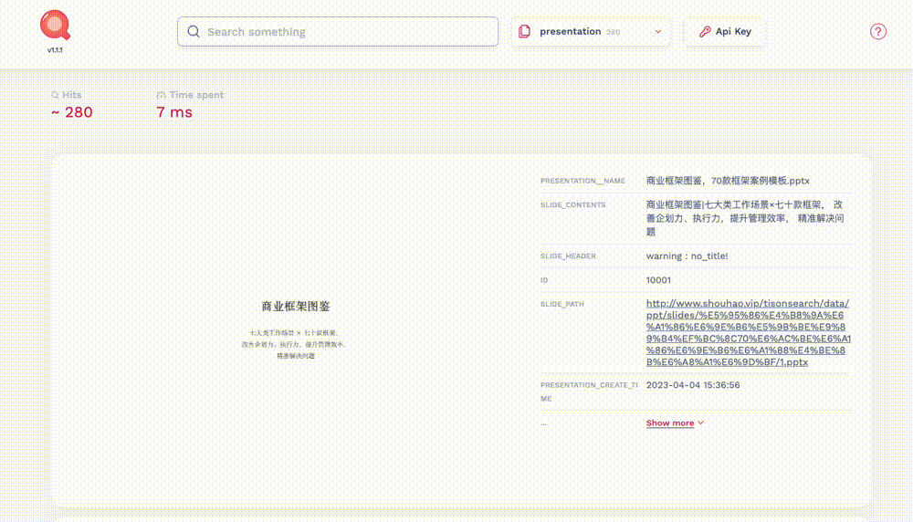

# OpenSA 
OpenSA 是一个旨在为数据智能领域解决方案架构师提供学习与成长资源的知识库。 
## 项目内容
这个项目汇集了全球顶尖科技公司在大数据、云计算与人工智能领域的解决方案案例与详细分享。
项目以**可视化搜索引擎**的形式出现,支持根据**公司名称**、**关键技术**或**应用场景**等**多维度**快速找到所需的解决方案**PPT**、详细**方案讲解**或**技术资料**。内容涵盖**谷歌**、**微软**、**AWS**、**Meta**、**阿里**、**腾讯**、**华为**等公司在**数据架构**、**数据治理**、**机器学习**等领域的成功实例,为数据与技术专家提供宝贵的学习参考与借鉴。  
## 功能与价值
全方位解读行业领先企业的**技术架构**与**创新应用**,学习他们如何通过**数据资产**激发业务增长新引擎。项目内容丰富专业而吸引人,旨在帮助数据与AI相关从业者更快速的获取产业最佳实践与案例观摩机会。 
通过这些全球顶级科技公司的成功案例分享,用户可以快速了解全球数据与人工智能领域的最新技术运用与发展趋势。同时也可以找到最切合自身业务发展与数据战略的技术借鉴和运用参考,加速推进企业数据转型与智能升级进程。我们将持续更新更丰富和更权威的案例分享,不断丰富学习与研发者的专业知识与技能。
OpenSA 致力于成为数据智能领域解决方案架构师的专业学习与资源中心,帮助他们通过行业顶尖公司的成功案例不断提高数据科技运用能力,加速推动企业数字化转型升级。

网址：http://www.shouhao.vip:3000/
 
公众号：数据智能DataISolution

		

## 使用示例

 

  

 

现在已搜集**数千案例**，**数万页PPT**材料，支持**内容级别搜索**，以下是部分案例列表：

|      | topic                                                              | issue_time   |
|-----:|:-------------------------------------------------------------------|:-------------|
|    0 | 图计算在翼支付风控场景的应用                                       | Today        |
|    1 | 图算法在阿里风控系统中的实践                                       | 2 days ago   |
|    2 | 基于知识的神经符号结合的离散推理研究                               | 3 days ago   |
|    3 | 面向大规模深度学习训练的缓存优化实践                               | 4 days ago   |
|    4 | 知识可迁移图神经网络及其在金融风险预测中的应用                     | 5 days ago   |
|    5 | 秒级响应B站基于 Iceberg 的湖仓一体平台构建实践                     | 6 days ago   |
|    6 | 阿里云数据湖统一元数据与存储管理实践                               | 1 week ago   |
|    7 | 基于图数据库的知识图谱存储技术及实践                               | 1 week ago   |
|    8 | 读时建模技术在异构数据分析平台的应用                               | 1 week ago   |
|    9 | 基于知识增强和预训练大模型的 Query 意图识别                        | 1 week ago   |
|   10 | 多模态 DNN 模型在药物相互作用预测任务中的应用                      | 1 week ago   |
|   11 | 快手流批一体数据湖构建实践                                         | 1 week ago   |
|   12 | 查询时长下降10倍网易有数 BI 物化视图设计要点与内部实践             | 05/14        |
|   13 | CV CUDA在微博多媒体内容理解的应用                                  | 05/13        |
|   14 | 蔚来汽车深度学习算法实践                                           | 05/10        |
|   15 | 推荐系统技术综述                                                   | 05/08        |
|   16 | 数据标准和数据质量技术解析与典型案例                               | 05/07        |
|   17 | Apache Doris 极速数据湖分析技术细节公开                            | 05/06        |
|   18 | 网易云音乐实时数仓架构与低代码实践                                 | 05/05        |
|   19 | 腾讯内容生态实时信号系统实践                                       | 05/04        |
|   20 | 因果推断在微视激励和供需场景的应用                                 | 05/03        |
|   21 | 飞桨面向异构场景下的自动并行设计与实践                             | 05/02        |
|   22 | 清华大学崔鹏可信智能决策框架及实践                                 | 05/01        |
|   23 | 集成多关系图神经网络                                               | 04/30        |
|   24 | 微信 NLP 算法微服务治理                                            | 04/29        |
|   25 | 因果推荐技术在营销和可解释性上的应用                               | 04/28        |
|   26 | 如何搭建好的数据指标体系                                           | 04/27        |
|   27 | 图数据库查询与算法正确性验证                                       | 04/27        |
|   28 | 怎么做精准投放与转化阿里多渠道序列化投放技术揭秘                   | 04/26        |
|   29 | DAMOYOLO兼顾速度与精度的高效目标检测框架                           | 04/25        |
|   30 | 微博推荐实时大模型的技术演进                                       | 04/24        |
|   31 | 互联网大厂迎来裁员潮算法工程师如何挨过职业寒冬                     | 04/22        |
|   32 | 数据治理与数据中台架构                                             | 04/21        |
|   33 | 决定产品的成败数据产品建设中的组织分析                             | 04/20        |
|   34 | 基于 Echarts 的数据可视化在异构数据平台的实践                      | 04/14        |
|   35 | 基于 StarRocks 进行湖仓融合的四种范式                              | 04/13        |
|   36 | 翼支付云原生数据开发与治理平台实践                                 | 04/11        |
|   37 | 淘宝个性化推荐中自适应与无监督的多场景模型建模实践                 | 04/10        |
|   38 | 中原银行如何从0到1建设敏捷BI平台                                   | 04/09        |
|   39 | 数据治理体系建设与实践                                             | 04/08        |
|   40 | 低延时音视频技术在OPPO云渲染场景的应用                             | 04/07        |
|   41 | 快手增长渠道数据产品实践                                           | 04/06        |
|   42 | CMU张坤因果表征技术最新进展                                        | 04/05        |
|   43 | 微信基于 PyTorch 的大规模推荐系统训练实践                          | 04/03        |
|   44 | 飞猪旅行场景下的实时用户理解服务                                   | 04/01        |
|   45 | 数据治理驱动下的开发治理平台建设                                   | 03/31        |
|   46 | 流批一体的实时特征工程平台建设实践                                 | 03/28        |
|   47 | 抖音集团数据指标体系分析与增长实践                                 | 03/27        |
|   48 | 电商领域AB实验平台建设方法                                         | 03/26        |
|   49 | 众安金融实时特征平台架构设计与实践                                 | 03/25        |
|   50 | 深度 UPLIFT 模型在腾讯金融用户增长场景中的应用                     | 03/24        |
|   51 | 淘宝虚拟电商技术分享                                               | 03/22        |
|   52 | 美团酒旅图谱构建及应用                                             | 03/20        |
|   53 | 新一代云数据平台架构演进之路                                       | 03/15        |
|   54 | 使用 CnosDB 与 TensorFlow 进行时间序列预测                         | 03/15        |
|   55 | 如何构建好的用户画像平台                                           | 03/13        |
|   56 | Apache Kyuubi 160 新特性解读                                       | 03/12        |
|   57 | 快手双边市场的复杂实验设计问题                                     | 03/11        |
|   58 | 银行数据安全管理的思考                                             | 03/10        |
|   59 | AI 算法在大数据治理中的应用                                        | 03/08        |
|   60 | 阿里可解释性推荐算法应用                                           | 03/06        |
|   61 | Calibration4CVR2018年关于神经元级别共享的多任务CVR的初探           | 03/05        |
|   62 | AliceMind大规模预训练实践及AIGC在ModelScope中的应用                | 03/04        |
|   63 | 中小银行数据安全治理体系建设实践                                   | 03/02        |
|   64 | 基于事件感知的聚类增益网络在飞猪保险创意排序的应用                 | 02/28        |
|   65 | 火山引擎DataLeap数据血缘技术实现与具体用例                         | 02/26        |
|   66 | T3 出行基于 HudiKyuubi 的现代技术栈探索                            | 02/25        |
|   67 | PrestoAlluxio 加速 Iceberg 数据湖访问                              | 02/24        |
|   68 | GNN的基础前沿和应用                                                | 02/22        |
|   69 | ChatGPT技术国产化尝试                                              | 02/20        |
|   70 | 度小满自动机器学习平台实践                                         | 02/18        |
|   71 | 小米大数据存储服务的数据治理实践                                   | 02/18        |
|   72 | 吞吐提升30倍CV流水线走向全栈并行化                                 | 02/11        |
|   73 | 盒马供应链算法实战                                                 | 02/13        |
|   74 | 腾讯广告模型基于太极的训练成本优化实践                             | 02/14        |
|   75 | 2万字揭秘阿里巴巴数据治理平台建设经验                              | 02/16        |
|   76 | 腾讯文本理解系统 TexSmart 中的细粒度实体识别关键技术               | 02/16        |
|   77 | 可扩展的图神经结构搜索系统                                         | 02/08        |
|   78 | B站基于缓存优化 PRESTO 集群查询性能                                | 02/12        |
|   79 | 纺织供应链中的金融大数据风控体系                                   | 02/05        |
|   80 | 腾讯灯塔融合引擎的设计与实践                                       | 02/04        |
|   81 | 数据集成平台 SeaTunnel V2 架构演进                                 | 02/02        |
|   82 | 快手精排模型实践                                                   | 02/01        |
|   83 | 快手精排模型实践                                                   | 01/31        |
|   84 | 腾讯数据治理技术实践                                               | 01/31        |
|   85 | 领域知识增强的预训练语言模型在药电商搜索领域的实践                 | 01/30        |
|   86 | 京东零售在电商搜索场景下的数据科学实践                             | 01/29        |
|   87 | 基于预训练语言模型的行业搜索的应用和研究                           | 01/29        |
|   88 | 基于预训练语言模型的行业搜索的应用和研究                           | 01/28        |
|   89 | 图神经网络在科学领域的应用                                         | 01/27        |
|   90 | 一文详解BI平台火山引擎DataWind架构和实践                           | 01/26        |
|   91 | 腾讯内部数据治理实践                                               | 01/26        |
|   92 | 深度召回在飞猪旅行推荐系统中的探索和实践                           | 01/25        |
|   93 | 快手分布式高性能图平台KGraph及其应用                               | 01/23        |
|   94 | 阿里智慧供应链实践从数字孪生到智能决策                             | 01/22        |
|   95 | 基于表征学习的因果推断技术在快手的实践                             | 01/20        |
|   96 | 深入解读 Flink CDC 增量快照框架                                    | 01/20        |
|   97 | 腾讯 Alluxio加速新一代大数据与 AI 变革                             | 01/19        |
|   98 | 小红书社区反作弊探索与实践                                         | 01/17        |
|   99 | 大模型推动的人机交互对话                                           | 01/15        |
|  100 | 腾讯人脸高效率 3D 数字化技术研究                                   | 01/12        |
|  101 | 阿里健康医药电商搜索相关性实践                                     | 01/11        |
|  102 | 数字人建模和动画关键技术                                           | 01/09        |
|  103 | 字节跳动埋点成本治理实践                                           | 01/08        |
|  104 | 如何在因果推断中更好地利用数据                                     | 01/07        |
|  105 | 众安百亿级数据集成服务的架构实践                                   | 01/06        |
|  106 | 大模型工业化的方法论都藏在GPU里                                    | 01/04        |
|  107 | 腾讯大数据分布式任务调度平台US                                     | 01/03        |
|  108 | 基于沉淀数据的尾部流量建模方法                                     | 01/02        |
|  109 | 文件系统的发展趋势与 JuiceFS 的云上实践                            | 2022/12/31   |
|  110 | 金融数据治理实践与思考                                             | 2022/12/30   |
|  111 | 图表示学习技术在药物推荐系统中的应用                               | 2022/12/30   |
|  112 | 自动化特征工程和自动建模在风控场景的应用                           | 2022/12/28   |
|  113 | GraphSynergy基于人工智能的药物联用机制预测                         | 2022/12/25   |
|  114 | 阿里云ADB基于Hudi构建Lakehouse的实践                               | 2022/12/23   |
|  115 | 因果推断在度小满金融场景的应用探索                                 | 2022/12/22   |
|  116 | 百度曦灵数字人平台架构分享                                         | 2022/12/20   |
|  117 | 数据标签与指标在金融行业的应用                                     | 2022/12/18   |
|  118 | 多模态预训练技术在OPPO的应用                                       | 2022/12/17   |
|  119 | 图算法在风控场景的应用                                             | 2022/12/12   |
|  120 | POI 识别在飞猪搜索的探索与实践                                     | 2022/12/09   |
|  121 | 网易基于 Iceberg 的实时湖仓一体系统构建经验                        | 2022/12/08   |
|  122 | 小米电商推荐算法CVR模型实践                                        | 2022/12/07   |
|  123 | 阿里云机器学习平台 PAI 的云原生实践与落地                          | 2022/12/06   |
|  124 | 中通快递数据治理实践                                               | 2022/12/05   |
|  125 | 快手虚拟世界互动平台及解决方案                                     | 2022/12/04   |
|  126 | Palo百度基于 Doris 的应用实践                                      | 2022/12/03   |
|  127 | 基于预训练语言模型的可控文本生成研究与应用                         | 2022/12/01   |
|  128 | 网易严选AB科学实验平台实践                                         | 2022/11/30   |
|  129 | 字节跳动下一代AB实验系统思考                                       | 2022/11/27   |
|  130 | 阿里云运维全观测提效降本最佳实践                                   | 2022/11/27   |
|  131 | 数据治理视角下的可观测性                                           | 2022/11/26   |
|  132 | 火山引擎AB测试平台设计思路与技术实现                               | 2022/11/25   |
|  133 | OPPO 对话式 AI 助手小布演进之路                                    | 2022/11/24   |
|  134 | 达摩院多模态预训练模型的轻量适配技术探索                           | 2022/11/23   |
|  135 | 英伟达在自然语言生成领域的最新研究进展                             | 2022/11/22   |
|  136 | 图视角下的信息抽取技术研究                                         | 2022/11/21   |
|  137 | 网易数帆数据治理演进                                               | 2022/11/20   |
|  138 | Presto AlluxioB站数据库系统性能提升实践                            | 2022/11/19   |
|  139 | 从神经搜索到多模态应用                                             | 2022/11/16   |
|  140 | Flink ML基于 DataStream 的迭代引擎及机器学习算法库文末附PPT下载    | 2022/11/15   |
|  141 | 数据湖Iceberg技术在小米的落地与场景应用                            | 2022/11/13   |
|  142 | 因果推断在腾讯游戏中的应用                                         | 2022/11/12   |
|  143 | 阿里实时机器学习场景解决方案的设计建设与规划文末附PPT下载          | 2022/11/09   |
|  144 | 神策数据营销策略引擎的技术演进                                     | 2022/11/07   |
|  145 | 字节跳动数据湖索引演进                                             | 2022/11/05   |
|  146 | 面向可解释性的知识图谱推理研究                                     | 2022/11/04   |
|  147 | 腾讯欧拉数据治理平台思考与实践                                     | 2022/11/02   |
|  148 | 网易严选跨域多目标算法演进                                         | 2022/11/01   |
|  149 | NVIDIA Merlin HugeCTR 推荐系统框架介绍                             | 2022/10/31   |
|  150 | 达摩院SPACE对话大模型知识注入与知识利用                            | 2022/10/30   |
|  151 | 快手异质性因果效应模型构建及应用                                   | 2022/10/29   |
|  152 | 腾讯 Angel Graph 图计算框架在智能风控中的应用                      | 2022/10/28   |
|  153 | 几何图神经网络在百度生物计算平台的应用                             | 2022/10/28   |
|  154 | 浅谈以数据为中心的人工智能                                         | 2022/10/27   |
|  155 | 用户画像从0到100的构建思路                                         | 2020/03/31   |
|  156 | 翼支付数据治理实践之元数据管理                                     | 2022/10/26   |
|  157 | ETA推荐系统高效用户长序列建模模型                                  | 2022/10/24   |
|  158 | 如何设计一个风控实验以度小满风控实验平台架构设计为例               | 2022/10/22   |
|  159 | 阿里 DeepRec 大规模稀疏模型训练推理引擎文末附PPT下载               | 2022/10/21   |
|  160 | 超融合时序数据库 YMatrix 在数字汽和脑的实践                        | 2022/10/20   |
|  161 | Flink Table Store流批一体存储                                      | 2022/10/19   |
|  162 | 百度大模型与小模型联动及落地                                       | 2022/10/18   |
|  163 | 字节跳动流式数仓和实时分析服务的思考和实践                         | 2022/10/17   |
|  164 | 百度自动化与可解释深度学习最新成果与工业应用                       | 2022/10/15   |
|  165 | IWSLT 2022 华为离线语音翻译和等长口语翻译技术解读                  | 2022/07/30   |
|  166 | 阿里妈妈深度树检索技术TDM及应用框架的探索实践                      | 2019/08/16   |
|  167 | 实时数据湖 Flink Hudi 实践探索                                     | 2022/10/14   |
|  168 | 面向社交媒体的多模态属性级情感分析研究                             | 2022/10/13   |
|  169 | 张俊林推荐系统排序环节特征 Embedding 建模                          | 2022/10/12   |
|  170 | 预训练语言模型压缩双塔蒸馏在美团上的落地实践                       | 2022/10/10   |
|  171 | 浅谈软件国产化对数据技术发展的影响                                 | 2022/10/09   |
|  172 | 分布式存储在B站的应用实践                                          | 2022/10/08   |
|  173 | 百度文心PLATO开放域对话技术及其应用                                | 2022/10/07   |
|  174 | 图机器学习在蚂蚁集团安全风控场景的应用                             | 2022/10/06   |
|  175 | Spark on k8s在阿里云EMR的优化实践                                  | 2022/10/05   |
|  176 | 字节跳动基于数据湖技术的近实时场景实践                             | 2022/10/04   |
|  177 | 真实世界医疗知识图谱及临床事件图谱构建                             | 2022/10/03   |
|  178 | 阿里实时数仓平台Hologres建设实践                                   | 2022/10/02   |
|  179 | 浅谈工业数据的收集处理与分析                                       | 2022/10/01   |
|  180 | 知识图谱在美团搜索酒旅场景认知中的应用                             | 2022/09/30   |
|  181 | Doris在蔚来汽车的应用                                              | 2022/09/29   |
|  182 | 隐私计算在大数据AI领域的应用实践英特尔BigDL PPML案例分享           | 2022/09/28   |
|  183 | 在机器翻译等通用任务场景下如何最有效地引用对比学习                 | 2022/09/27   |
|  184 | 搜索场景下的智能实体推荐                                           | 2022/09/26   |
|  185 | 美团基于知识图谱的个性化新闻推荐系统                               | 2022/09/25   |
|  186 | 360 x 清华大学图文跨模态表示最新研究成果公开                       | 2022/09/24   |
|  187 | 基于 Doris 的知乎 DMP 系统架构与实践                               | 2022/09/22   |
|  188 | 图谱问答在小米小爱中的实践探索                                     | 2022/09/21   |
|  189 | Graph4NLP业内首个针对NLP场景的GNN开源软件库                        | 2022/09/20   |
|  190 | 腾讯图神经网络与推荐预训练模型                                     | 2022/09/19   |
|  191 | 图机器学习在蚂蚁集团推荐业务中的应用                               | 2022/09/18   |
|  192 | 字节跳动数据湖在实时数仓中的实践                                   | 2022/09/17   |
|  193 | 杉数科技王子卓博士数据驱动的智能决策                               | 2022/09/16   |
|  194 | 网易数帆数据治理20实践分享                                         | 2022/09/14   |
|  195 | QQ浏览器搜索中的智能问答技术                                       | 2022/09/13   |
|  196 | 可证明安全的隐私计算                                               | 2022/09/12   |
|  197 | Flink Table Store v02 应用场景和核心功能                           | 2022/09/11   |
|  198 | 华为图神经网络在推荐系统中的应用                                   | 2022/09/10   |
|  199 | 腾讯音乐评论审核分类与排序技术                                     | 2022/09/09   |
|  200 | 基于Elasticsearch的指标可观测实践                                  | 2022/09/08   |
|  201 | 自动化AutoML工具Pluto在OPPO的典型应用                              | 2022/09/07   |
|  202 | Neo4j图数据科学及20版本新功能介绍                                  | 2022/09/06   |
|  203 | 揭秘字节跳动解决ClickHouse复杂查询问题的技术实践                   | 2022/09/05   |
|  204 | Alluxio 28版本新看点                                               | 2022/09/04   |
|  205 | 强化学习在京东618大促流量调控中的落地应用                          | 2022/09/02   |
|  206 | 货拉拉基于 Doris 的 OLAP 体系演进及建设方法                        | 2022/09/01   |
|  207 | 数据编排技术在联通的应用                                           | 2022/08/31   |
|  208 | 推荐算法中的特征工程                                               | 2022/08/30   |
|  209 | Apache Iceberg在网易严选批流一体的实践                             | 2022/08/29   |
|  210 | 华为在联邦广告算法上的探索及应用                                   | 2022/08/28   |
|  211 | 虎牙直播用户增长中台算法与工程实践                                 | 2022/08/27   |
|  212 | 知识图谱物联网和数字孪生智能供应链的数字基础设施                   | 2022/08/24   |
|  213 | 网易传媒数据管治建设实践                                           | 2022/08/23   |
|  214 | 吴喆全民K歌直播推荐系统详解                                        | 2022/08/22   |
|  215 | 如何基于数据科学进行用户兴趣分群爱奇艺算法验证和迭代思路公开       | 2022/08/21   |
|  216 | Atlas超算平台基于 Fluid Alluxio 的计算加速实践                     | 2022/08/20   |
|  217 | 多租的安全性怎么保障揭秘阿里云大数据平台MaxCompute在多租上的实现   | 2022/08/19   |
|  218 | 智能决策技术在汽车行业的应用实践                                   | 2022/08/16   |
|  219 | 网易严选DMP标签系统建设实践                                        | 2022/08/14   |
|  220 | 快看漫画构建数据治理闭环的逻辑与实践                               | 2022/08/13   |
|  221 | 多任务学习在风控场景的应用探索及案例分享                           | 2022/08/12   |
|  222 | 北大关于知识图谱与图数据库的研究工作                               | 2022/08/11   |
